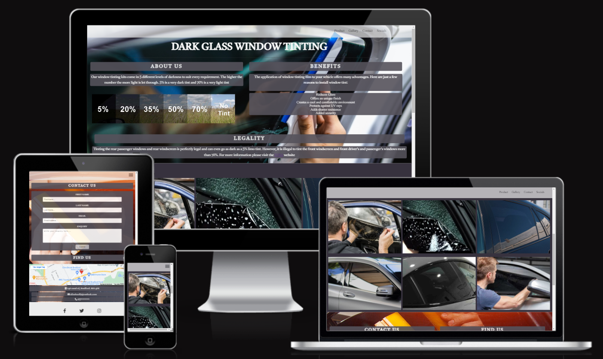

# **Dark Glass Window Tinting**

Dark Glass Window Tinting is a site that is designed to provide useful information to help people understand the benefits of tinting vehicle windows.
The site is targeted towards potential and existing customers based around the Bradford area who are looking for a professional and established vehicle tinting service. 

The site uses a single page scroller format for compatibility across various devices without over complicating my code. This gives site a much smoother flow and keeps in line with the intended prestigeous, modern look.

 

## Table of contents
1. [**Planning Stage**](#planning-stage)
1. [**Features Common to all Pages**](#features-common-to-all-pages)
1. [**Features on Individual Pages**](#features-on-individual-pages)
1. [**Future Features to be Added**](#future-features-to-be-added)
1. [**Testing**](#testing)
1. [**Bugs**](#bugs)
1. [**Other Changes**](#other-changes)
1. [**Deployment**](#deployment)
1. [**Technology Used**](#technology-used)
1. [**Credits**](#credits)

## **Planning Stage**

### **Target Audience**
* Users who are looking for a window tinting service around Bradford
* Users who are looking to learn more about window tinting
* Users who are looking to understand the benefits of window tinting

### **Site Aims**
* Educate the user on the legalities of window tinting
* Show the user the various options available for tinting percentages
* Provide the user with information that tells them who Dark Glass tinting are and where to find it
* Give the user an opportunity to contact the business to make an enquiry

### **Color Scheme**
I chose a neutral colour scheme grey colour scheme for the product and contact pages to deliver a sense of prestige in keeping with the company branding (#55525B) and making viewing easy for the user, opting for an off-white/grey text on the product and contact pages (#FAFAFA). For the navigation and footer menus I chose an off-white for the background (#E2E3E4) and a charcoal grey for the text (#46494C). For the header and footer I chose a slightly darker off-white background (#EBEBEB) with a dark grey colour (#3A3A3A) for the menu text and icon colours. For the gallery page I used a darker grey (#37323E) than the rest of the pages to help the user identify the page seperations.I used (https://webaim.org/resources/contrastchecker/) to check the contrasting colors worked well, as the gallery pages only has images I was unable to use the contrast checker.
 * Main background
 
 * Navigation and Footer
 

## **Features Common to all Pages**
### **Navigation Bar**

 * Located at the top of the page
 * Its partially transparent grey background is designed to give a sense of style and prestige to the brand
 * For ease of navigation when the mouse is hovered over a link, the background is highlighted so the user can see which menu they are selecting
 * As the page size decreases the nav bar is fully responsive and at the mobile level displays as a burger menu
 * As the burger menu icon is selected a block menu appears and the burger menu icon transforms into a menu close X icon
 * The navigation bar is designed to be a non disruptive visually pleasing experience that allows the user to easily and clearly navigate the business website

 ### **Footer**

 * Located at the bottom of the page
 * Its white background is designed to be clear and simple to navigate
 * The footer has links to the Dark Glass Window Tinting social media pages on facebook, instagram and twitter displayed by icons
 * For ease of navigation as the mouse is hovered over an icon, the icon colour changes to lilac so the user can see the icon is being selected
 * As the page size decreases the Social Media icons stay central on the footer

 ## **Features on Individual Pages**
 ### **Product (Home) Page**
 
 * The About Us section will allow the user to understand the varieties of tinting options available and make an informed choice on the level of tint they require
 * It also shows the user the benefits of window tinting
 * As the page size decreases the text area decreases along with the font size. As the page size decreases to fit mobiles the about us and benefits become block and display as a list, making usability on smaller screens easier

### **Gallery Page**

* The gallery will provide informative images to the user so they can see examples of previous window tinting applications
* The gallery is valuable as the user can easily identify the quality of work provided by Dark Glass Window Tinting
* The user can visually see the process and finished product provided by Dark Glass Window Tinting
* The page is responsive and is displayed in a grid layout, when scaling to mobile the images stack on top of each other

### **Contact Us Page**

* This page will allow the user to make an enquiry with Dark Glass Window Tinting
* The user will be asked to submit their First name, Last name, Email address and their enquiry
* This will allow Dark Glass Window Tinting to get in touch with the customer to provide a quotation for their enquiry
* A background image is used behind the form so the user. This image displays the tinting process so the user can understand how the process works
* The page is fully responsive with the form scaling to fit mobile screens

## **Future Features to be Added**
The Dark Glass Window Tinting site is currently at the minimum viable product stage. Future features to be added to increase site usability include:
* 
* 
 * 
 * A news page where bulletins can be posted for upcoming offers and new product releases
 * An affiliate links page to various 

 ## **Testing**
I have tested the site in the Chrome, Firefox and Edge browsers, using dev tools to test responsiveness. I have also asked users to review on mobiles on both Android and IOS and had no issues fed back. 

### **Responsiveness**
![Am I Responsive?] 
I opted for a single page desktop first design approach with extensive testing to allow responsive sizing on smaller devices. The Chrome browser built in Dev tool was used for responsive testing as well as using various mobile/tablet devices. I also used (http://ami.responsivedesign.is/) to check there were no issues across all screen sizes. No issues were found.

1. **992px (Laptops)**
  * Product Page
    * 'About us' and 'Benefits' text areas made to take up half a page each
    * Tinting scale image pushed under 'About us'
  * Gallery Page
    * Images arranged into columns of 3
  * Footer
    * Footer social media links centralised to look better on all sized screens
  * Contact Us
    * Google map and contact form set side by side to keep sizing in proportion as to not look overbearing  
1. **768px (Tablets)**
  * All Pages
    * Burger menu added to header to correct text overlap
    * Font sizing set to rem sizes to allow for responsive sizing
  * Product Page
    * About us and Benefits stacked on top to make text readable
  * Gallery Page
    * Image columns reduced to stacked images
  * Contact Us
    * Google map and contact form stacked to allow for better visibility
    * Email address and Contact phone number set to full width to correct positioning issue  
1. **600px (Mobiles)**
  
1. **400px (Smaller screens)**
  

### **Lighthouse**
All pages have been tested with lighthouse for both mobile and desktop devices with all scores acheiving above 90, however my performance score for mobile was 3 points lower than desktop

- Tested Lighthouse on mobile

- Tested Lighthouse on desktop

  ### **Validators**

  My HTML file was run through (https://validator.w3.org/) and my CSS file was run through (https://jigsaw.w3.org/css-validator/) to ensure all code meets the correct standard. My HTML code flagged up 1 error in regards to my gallery section not having a title, this was intentional for my design

1. index.html
 * Warning: Section lacks heading. Consider using h2-h6 elements to add identifying headings to all sections.

 

- No errors were returned when passing through the official css validator

 

 ## **Bugs**

## **Other Changes**
I removed all \<hr\> tags from the site and replaced them with \<div\>, setting a style in CSS to create the same effect. This is because \<hr\> is now defined in semantic terms, rather than presentational terms. For my site I use \<hr\> as presentational only

## **Deployment**
The site was deployed to GitHub pages. The steps to deploy are as follows:

In the GitHub repository, navigate to the Settings tab
In the pages section, go to select branch drop-down menu, select Main
Once the Main branch has been selected, a link to the site is provided

The live link can be found here - (INSERT LINK)

You can access the live site via the following link INSERT LINK

## **Technology Used**
Dark Glass Window Tinting was built using HTML5 and CSS3

## **Credits**

### **Content**
* 
* 
* The project was influenced by the Code Institutes code along project called Love running and coders coffee house. Whilst I have tried to deviate as much as possible and do my own thing, there may be some similarities in the code.
* For general research when tackling something I required support on I generally relied on W3 Schhols for information
* Icons used are from [Font Awesome](https://fontawesome.com/)

### **Media**
* The background and gallery images were taken from [Pexels](https://www.pexels.com/)

### **Thanks**
 * [Richard Wells](https://github.com/D0nni387) - Code Institute mentor who's advice and guidance supported me in the completion of this project